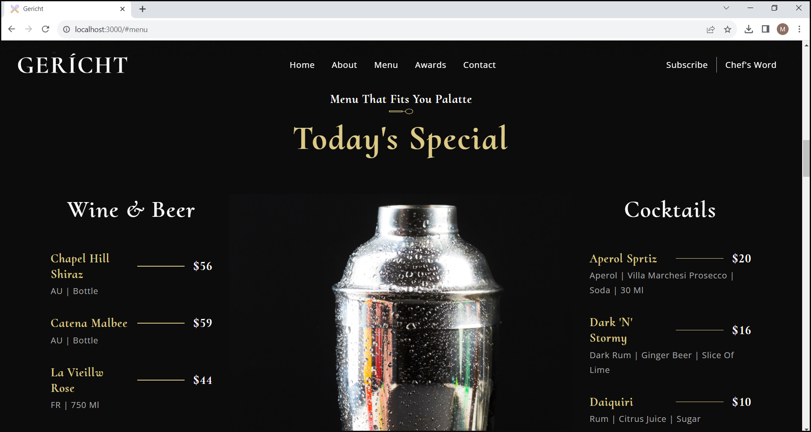
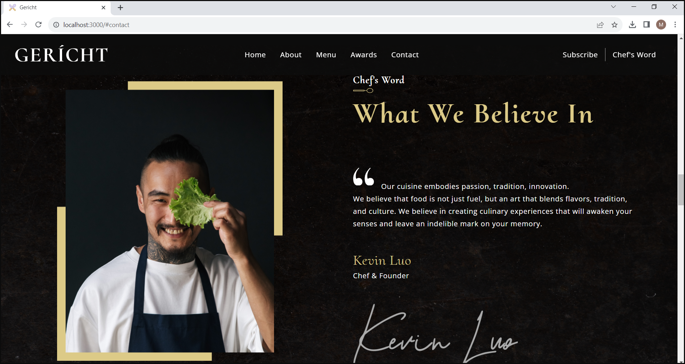
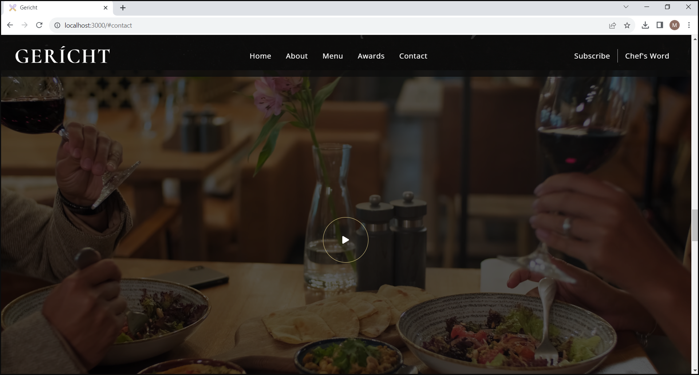

# About Project
<p align="justify"> 
This repository contains source code for restaurant website. It is built with React.js library and inspired by <a href="https://ui8.net/iqonicdesign/products/gericht-restaurant-website-ui-in-figma">amazing Figma design</a>.
</p>


# Demonstration
<div align="center">

  https://github.com/mkokor/restaurant-website/assets/126569077/78ea29b8-957a-4d3b-bf9f-ed2509621c3e

</div>

## Home Section
<div align="center">
   
</div>

## About Us Section
<div align="center">
  
</div>

## Special Menu Section
<div align="center">
  
</div>

## Chef's Word Section
<div align="center">
  
</div>

## Video Section
<div align="center">
  
</div>

## Awards Section
<div align="center">
  
</div>

## Gallery Section
<div align="center">
  
</div>

## Find Us Section
<div align="center">
  
</div>

## Footer Section
<div align="center">
  
</div>


# Getting Started
<p align="justify">
Follow the instructions below to get local copy up and running.
</p>

## Installation
1. Clone the repository
```bash
git clone https://github.com/mkokor/restaurant-website.git
```
3. Install NPM packages
```bash
npm install
```

## Execution
<p align="justify">
Run command below to start the application.
</p>

```bash
npm start
```

<p align="justify">
Website home page can be accessed on <a href="http://localhost:3000/">http://localhost:3000/</a>.
</p>
